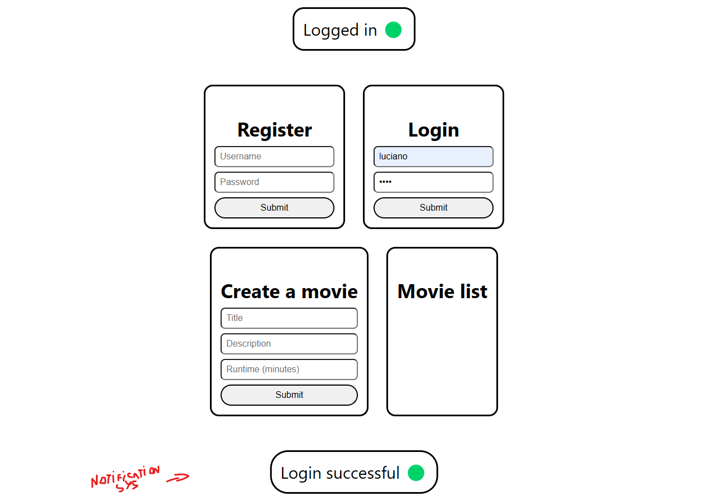

# Authentication Challenge

## Not Logged

## Logged

## Learning Objectives

- Use a token-based approach to authorise access to API resources
- Use a hashing library to encrypt sensitive information
- Build a front-end application that interacts with a bearer-auth protected API

## Introduction

You are tasked with building a small frontend application containing 3 forms and a list. There is a screenshot at the bottom of this document that gives you an idea of what to aim for. As you'll be able to see, it doesn't have to _look_ good so don't spend time on styling!

The flow of the application you build looks like this:

1. A user fills in the register form to create their account with a hashed password
2. The user fills in the login form to get a bearer token
3. The user can then create movies once they have a valid token
4. The list of displayed movies will update as a user creates them

## Setting up

Take a little bit of time to familiarise yourself with the project structure - this exercise has both a front-end React app (`src/client/`) _and_ a back-end express API (`src/server/`) in it.

1. Fork this repository and clone the fork.
2. Rename `.env.example` to `.env`
3. Edit the `DATABASE_URL` variable in `.env`, swapping `YOUR_DATABASE_URL` for the URL of the database you just created. Leave `?schema=prisma` at the end.
4. Edit the `SHADOW_DATABASE_URL` variable in `.env`, swapping `YOUR_SHADOW_DATABASE_URL` for the URL of a shadow database you created in an earlier exercise. Leave `?schema=shadow` at the end.
5. Run `npm ci` to install the project dependencies.
6. Run `npx prisma migrate reset` to execute the database migrations. Press `y` when it asks if you're sure.

## Instructions

- Run the app with `npm start` - this will open a React app in your browser _and_ run the express server. The server will default to port `4000`, you can change this by adding an `API_PORT` variable to your `.env` if you want.
- Work through each file in the `requirements` directory in numerical order. You can choose whether to work on the Client or Server version of each requirement first, but you may find it easier to do Server first.

## Example solution

