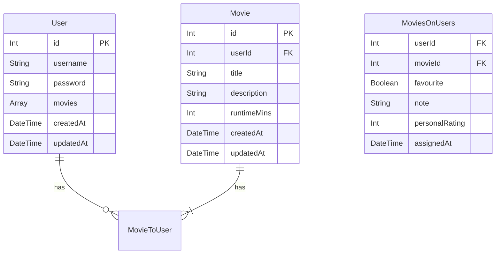

# m:n movies-users

## requirement

- The movies list is the same for all users - modify the schema and your server code so that each user has their own list of movies.

## ERD

## notes

- everyone visiting the page can see the current list of all the movies added
- a logged in user can see their own personal list as well
- a logged in user can edit their own personal list
- when the former happens, if the movie does not already exists in the db, create it
- ... if it already exists, simply add it to that user's personal list
